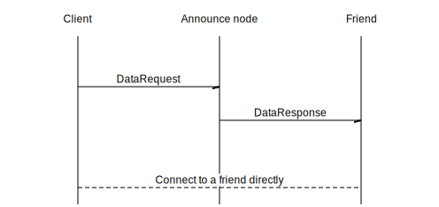

This is a description of onion layer in Tox.

## Paths

Onion routing can be described using this chart:


To send a message via an onion path, first we construct the path by choosing three random nodes. Then, we put the message in several layers:

1. `OnionRequest2` contains the address of the message receiver and the message encrypted with the third's node key 
2. `OnionRequest1` contains the address of the second node and `OnionRequest2` encrypted with the second's node key, and
3. `OnionRequest0` contains the address of the first node and encrypted `OnionRequest0`

A node that belongs to the path receives a message, decrypts the payload, attaches `OnionReturn` and sends the result to the next node in the path.

An `OnionReturn` of the n'th node is the pair of `IP_Port` and `OnionReturn` of the previous node (if it exists), encrypted with the n'th node's key. It allows the receiver to send a response to the sender using the same onion path.

## Client announce

An iteration of self announce:

1. Clean up the `announce_list` from timeouted nodes
2. For node `n` in `announce_list`:
	- If the node is out of ping credit, skip it
	- Check whether the node is not announced, announced or stable
	- If it's time to send an announce request, send it to the node
		- Update time and increment `ping_debt` of the node
3. If `announce_list` is not full, choose whether we should send to a path node
	- If so, send the announce request to a random path node (ping_id = 0)

A node is considered *timeouted*  if the last ping was more than `NODE_TIMEOUT` seconds ago and the node is out of ping credit.

A node is *out of ping credit* if `ping_debt` of the node is more than `MAX_NODE_PINGS`.

A node is *announced* if `is_stored` is not `0` and client's `self_paths` contains a path with the `path_num` of the node. An announced node is called *stable* if the node by itself is stable and the corresponding path is stable.

A node is *stable by itself* if it was added more than `TIME_TO_STABLE` seconds ago, its `ping_debt` is zero, the node was pinged less than `NODE_TIMEOUT` seconds ago.

A path is called *stable* if it was created more than `TIME_TO_STABLE` seconds ago, the `usage_debt` of the path is zero and the path was not used for more than `PATH_TIMEOUT`.

It is time to send an announce request if:

1. A node was pinged more than `interval` seconds ago, where `interval` is one of `ANNOUNCE_INTERVAL_NOT_ANNOUNCED`, `ANNOUNCE_INTERVAL_ANNOUNCED`, `ANNOUNCE_INTERVAL_STABLE`, depending on the node type
2. Or the last announce was more than `NODE_PING_INTERVAL` seconds ago and `random(MAX_ONION_CLIENTS_ANNOUNCE - i) == 0`, where `i` is the index of the node in the `announce_list`

The process of sending a self announce request to a node is the following:

1. First, get a random path with a given `path_num`.
2. Store a sendback in `announce_ping_array`, getting the sendback_id
3. Construct an announce request payload with
	- `search_id = real_pk`
	- `data_pk = temp_pk`
	- `ping_id = ping_id`
	- `sendback_data = sendback_id`
		- Where `real_pk` is the real public key, `temp_pk` is the temporary public key of the onion client.
4. The payload is encrypted using `{dest_pk, real_sk}`, where `dest_pk` is the public key of the destination, `real_sk` is the real secret key
5. Construct the request with the payload and `{pk = real_pk}`
6. Send the request via the onion path

Getting a random path:

1. If `path_num` is not `None`, set `path_index = path_num % NUMBER_ONION_PATHS`. Otherwise, set `path_index = random(0..NUMBER_ONION_PATHS)`
2. If `path_list[path_index]` is timed out or doesn't exist:
	1. Get `ONION_PATH_LENGTH` random path nodes
	2. Check whether the last node belongs to some path
	3. If yes, then use that path
	4. If not:
		1. Create a new onion path
		2. Set times for the path
		3. Set `path_num = r(random_u32(), NUMBER_ONION_PATHS) + path_index`, where \\(r(a, n) = a - (a \bmod n)\\) – a “modulo rounding” function
3. Otherwise, just use the existing path
4. If the path is not out of usage credit, update `last_path_used`
5. Increment the usage debt of the path
6. Return the path

An announce response is handled in the following way:

1. Get the sendback from `announce_ping_array` using the `sendback_data`
2. Decrypt the payload using `{sb.node.pk, real_sk}`, where `sb.node.pk` is the public key stored in the sendback, `real_sk` is the real secret key
3. Set path timeouts using `{sb.friend_num, sb.path_num}`
4. Add the announce node to `announce_list`
5. Add the node to `path_nodes`
6. Get nodes from the payload and ping them (if any)

The process of pinging a node is the following:

1. Clean up `announce_list` from timeouted nodes
2. A node in the payload is pinged if:
	1. It is closer to us than nodes in the `announce_list` or the list is not full
	2. And it doesn't belong to the list
	3. And it is good to ping
3. Pinging is sending an announce request with `ping_id = 0` via a random path

A node is good to ping if this is not the last pinged node unless the node was pinged more than `MIN_NODE_PING_TIME` ago.

A sequence chart for the beginning of self announce process (messages are sent via onion):


## Friend search and DHTPK announce

The overall process has two steps:

- First, we use announce requests to find announce nodes that stores paths to our friend
	- This process is similar to the announce process
- Then, we send (via onion) `DataRequest` to found announce nodes

This is the chart of the second step:



Specifically:

1. We start with constructing `DhtPkData`:
	- `no_replay = now` where `now` is the current time
	- `dht_pk = dht_pk` where `dht_pk` is our dht public key
	- `nodes = closest` where `closest` is a list of closest to us dht nodes
2. Serialize it into bytes and send as an onion data or via dht

The process of sending onion data is the following:

1. The `client_list` of a friend is cleaned up of timeouted nodes
2. Good nodes are with `is_stored != 0`
3. It should be more than `(num_nodes - 1) / 4 + 1` good nodes to continue where `num_nodes` is the number of nodes in `client_list`
4. Generate a random nonce
5. The data is encrypted using friend's real public key, our real secret key and the nonce
6. Construct `OnionData`:
	- `real_pk` is our real public key
	- `dht_pk_data` is the encrypted data
7. For each good node:
	1. Get a random friend path
	2. Construct a `DataRequest`:
		- `dest_pk = friend.real_pk`
		- `nonce = nonce`. The same nonce that we used before
		- `temp_pk = random_pk`. We generate a random keypair
		- The `payload` is the onion data encryped with the node's data public key and the random secret key, using the same `nonce`
	3. Send the request via the onion path

## Notes on data structures

Both `path_nodes` and `announce_list` are arrays of limited size. But the way they are updated are different.

When `path_nodes` is full, adding a new element replaces an old one in a circular manner: first adding an element replaces `path_nodes[0]`, then `path_nodes[1]`, and so on til we get to the end of the array. After that, we begin again with `path_nodes[0]`.

`announce_list` is different. It is sorted by distance to real our public key. When an element is added, it is checked against the farest node. If the element is closer to us than the node, the node is removed and the element is inserted. Otherwise, the element is simply discarded.

Some packet data structures:

```
struct DhtPkData {
    no_replay: u64,
    dht_pk: PublicKey,
    nodes: Vec<PackedNode>,
}

layout DhtPkData {
    u8 = ONION_DATA_DHTPK,
    u64,
    [u8; PUBLIC_KEY_SIZE],
    [[u8; PACKED_NODE_SIZE]; 0..MAX_SENT_NODES]
}
```

## Toxcore notes

In the C implementation, `ping_debt` and `usage_debt` are called `unsuccessful_pings` and `last_path_used_times` correspondingly. New names are chosen to represent the meaning of these variables more clearly.
